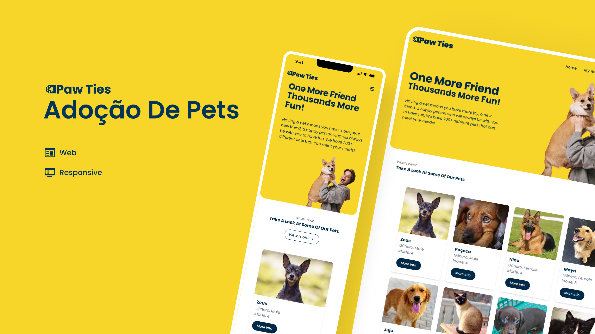

<div align="center">
  
</div>

<hr>
<br>



# Funcionalidades
- Cadastro, autenticação de usuários
- Cadastro de Pets
- Adoção de Pets

# Tecnologias utilizadas

## Front-end
- React.js
- Tailwind CSS
- Axios

## Back-end
- MongoDB Atlas
- API REST

# Como executar
Antes de tudo, na sua máquina deverá ter:
- Node.js
- Git

Será necessário instalar as dependências do projeto back-end que está no diretório `/api`, executá-lo, e então depois instalar e executar as dependências do front-end que se encontra no diretório `/frontend`.

## Executando o back-end
```bash
$ git clone https://github.com/Dnysss/Paw-Ties

$ cd Paw-Ties/api

```
Aqui será preciso criar um arquivo `.env` seguindo o exemplo do arquivo `.env.example`.

Para o envio de imagens, o sistema utiliza o serviço do `Firebase`. Será preciso criar uma conta, acessando este <a href="https://firebase.google.com/">link</a>.
# Aqui está um guia passo a passo sobre como configurar e usar o Firebase Storage
## Passo 1: Criar um Projeto no Firebase
- Vá para o Console do Firebase.
- Clique em "Adicionar projeto".
- Siga as instruções para configurar seu projeto.
## Passo 2: Configurar Firebase Storage
- No Console do Firebase, selecione seu projeto.
- Clique em "Storage" no menu da esquerda.
- Clique em "Iniciar" e siga as instruções para configurar o Firebase Storage.

## Passo 3: Verifique seu código de autenticação
Certifique-se de que está autenticando corretamente com a conta de serviço correta em seu código.
 Após isso, no arquivo `.env` atribua às variáveis de acordo com as configurações do Firebase.

## OBS: Certifique-se de que o bucket e o objeto têm as permissões corretas.
Caso haja algum erro de permissão, verifique as configurações no `Google Cloud Console`, vá para a seção do Cloud Storage, selecione o bucket e configure as permissões. Certifique-se de que a conta de serviço usada pelo aplicativo tem as permissões necessárias para acessar os objetos.

```bash
$ npm install # ou yarn install

$ npm run start # ou yarn start
```
## Executando o front-end
```bash
$ cd Paw-Ties/frontend

$ npm install # ou yarn install
```

Aqui será preciso criar um arquivo `.env` seguindo o exemplo do arquivo `.env.example`.

```bash
$ npm run dev # ou yarn dev
```
